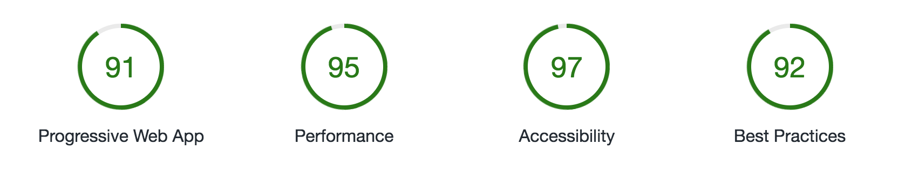

# RiotJS & Webpack 3 boilerplate

A Webpack 3 + Riotjs boilerplate with performance in mind.

Lighthouse performance


[https://pmcalabrese.github.io/riotjs-webpack/](https://pmcalabrese.github.io/riotjs-webpack/)

Features:
 - ES6
 - Bulma CSS
 - Webpack 3
 - Tree shaking
 - Code splitting
 - Support for SCSS
 - Service Worker with sw-precache [https://github.com/GoogleChrome/sw-precache](https://github.com/GoogleChrome/sw-precache)
 - Minimal footprint (the entire boilerplate index page is 50K including CSS)
 - Manifest file
 - Good lighthouse score
 - Routing with riot-route
 - Critical CSS

## Install

```bash
npm install
```

## Run locally for development

```bash
npm start
```

## Build for production

```bash
npm run build
```

## Build for production and run on a local server

```bash
npm run build-serve
```